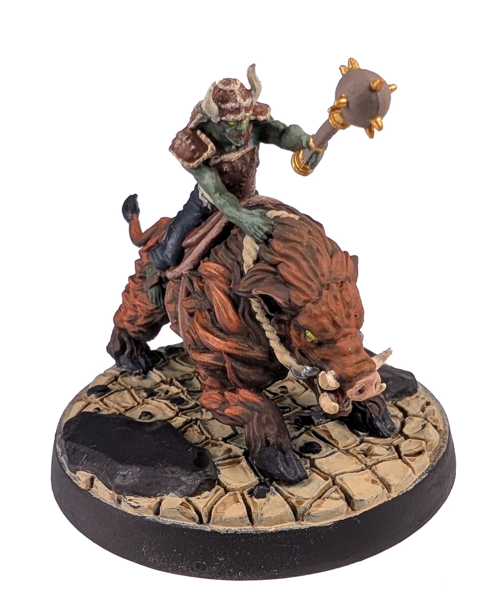
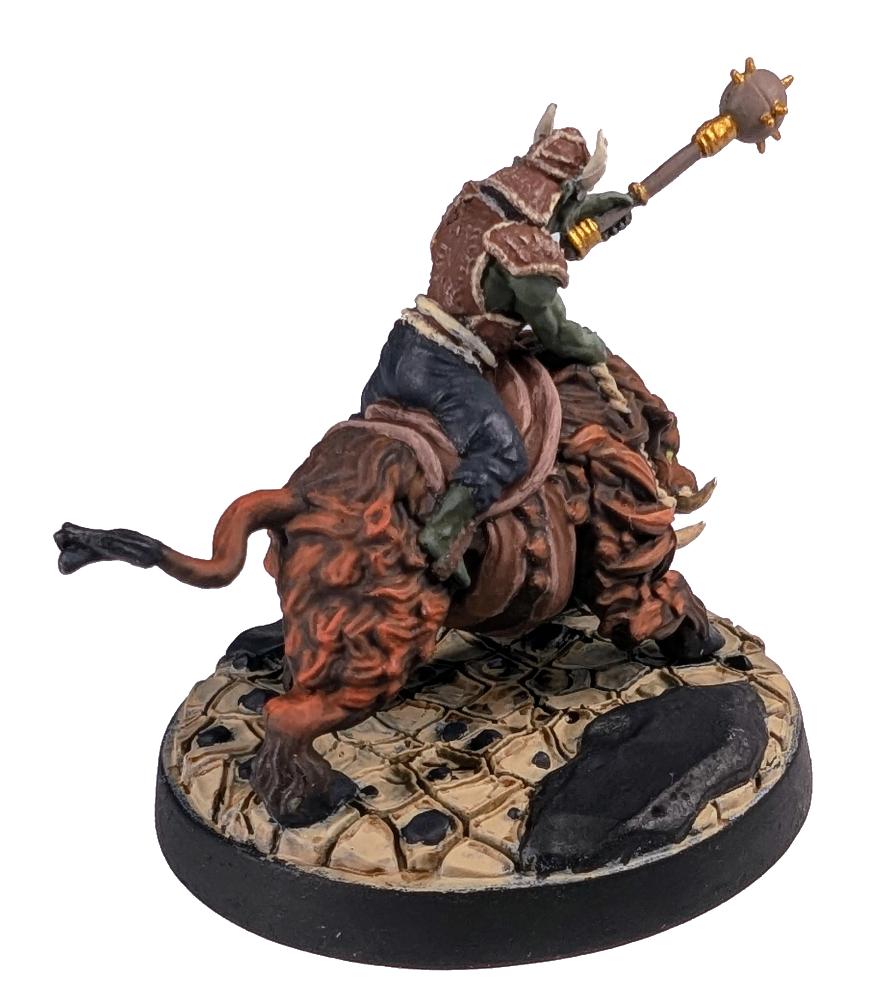
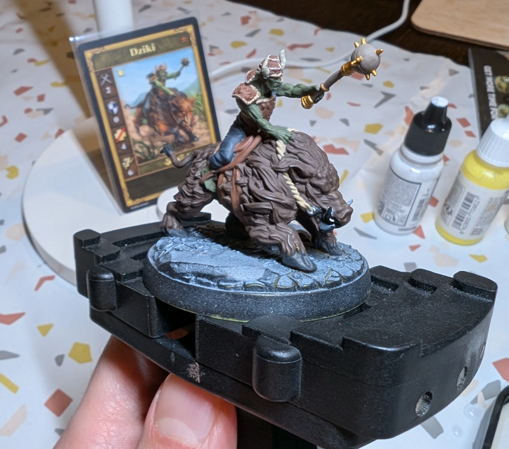

# Боров
<small>Читайте на другом языке: [:gb:](https://paint-h3.qwrtln.nl/posts/2025/02/boar/) [:pl:](https://pl.paint-h3.qwrtln.nl/posts/2025/02/dzik/)</small>

Моя первая попытка с миниатюрой с большой основой 5 см. Я постоянно попадал в ловушку «ещё один мазок кистью».

  

<!--more-->

  

    
  

  

    
  

Нажмите, чтобы посмотреть видео с распаковки

  <video width="1280" height="720" controls preload="none">
    <source src="/assets/videos/boar.webm" type="video/webm">
  </video>

Посмотрите Боровы на [Вики](https://homm3bg.wiki/units/boars).

Несмотря на все мои усилия, подобрать оригинальные цвета было практически невозможно, особенно для шерсти животного. Прежде чем браться за более сложных существ вроде драконов, нужно освоить технику сухой кисти на более простых объектах.

### Процесс

Я начал с базовых цветов (пропустив некоторые детали, например клыки зверя), не планируя весь процесс.

/// caption
Базовые цвета с видимым *zenithal priming* на основании
///

Я намеренно сделал шерсть тёмной (коричневый + чёрный), чтобы создать контраст с оранжевыми хайлайтами, добавленными позже. После первых попыток я отказался от чёрных теней, так как результаты были неубедительными. Второй слой был нанесён оранжевым + коричневым, чтобы соответствовать цвету карты, а финальные блики были нанесены сухой кистью чистым оранжевым.

Оставалось проработать детали морды зверя и лица наездника, правильные блики на коже гоблина, подсветить края седла и детали доспехов. С таким количеством похожих цветов выбор подходящей палитры был непростой задачей.

Основание окрашено в пустынный бежевый цвет (desert tan) с Agrax Earthshade в углублениях. Камни чёрные с небольшим добавлением синего для создания слегка серого оттенка.

### Вывод

Мне не стоит бояться использовать более сильные хайлайты. Кроме того, различия между похожими цветами следует планировать до начала работы над проектом.

А жена-дизайнер - это золото: служит отличным рычагом для творчества.
