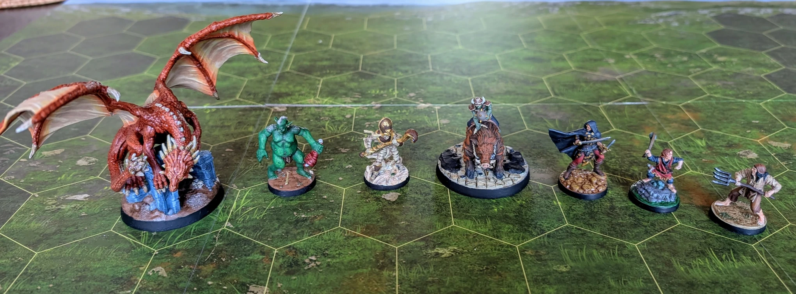

# Первая Семерка
<small>Читайте на другом языке: [:gb:](https://paint-h3.qwrtln.nl/posts/2025/02/first-seven-minis/) [:pl:](https://pl.paint-h3.qwrtln.nl/posts/2025/02/pierwsza-siódemka/)</small>

Уроки, извлечённые из начала приключения.

/// caption
Даже любительская покраска лучше чем голый пластик.
Так и хочется играть.
///

<!--more-->

Быстрая калькуляция: покраска 7 миниатюр заняла у меня около 3 месяцев. При таком темпе покраска всей игры займёт примерно 3 года. Посмотрим, сбудется ли этот прогноз.

Ключевые выводы на данный момент:

 - Это искусство следует определённым правилам, которые может освоить каждый, а их соблюдение приводит к достойным результатам.

 - Не стоит переживать о деталях или качестве, пока процесс доставляет удовольствие.
 Время течёт удивительно быстро, когда полностью сосредоточен на покраске следующей миниатюры.

 - Онлайн-видеоуроки имеют ограниченную ценность, если только они не показывают покраску чего-то очень похожего на ваш проект (пока я нашёл [одного ютубера](https://www.youtube.com/@olebrogger/search?query=heroes), который это делает).
 Большинство авторов уроков используют премиум-качества миниатюры и оборудование, которые мне либо недоступны, либо я не хочу в них инвестировать.
 Естественно, их уроки не выглядели бы так впечатляюще, если бы они использовали материалы более низкого качества.

 - Качественная кисть - это самый важный инструмент.
Хотя на других материалах можно сэкономить, кисть низкого качества ограничит ваши результаты.

 - Если у вас научный склад ума и вы начинаете путь в искусстве, это хобби положительно стимулирует ваш мозг.
Вы разовьёте навыки в тех областях, которые обычно не очень активны.
Что-то вроде обучения творческого друга программированию, только наоборот.

Надеюсь, я помог. Берите кисть и посмотрите, что из этого получится.
