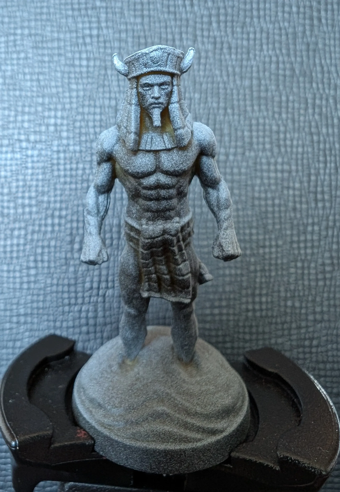
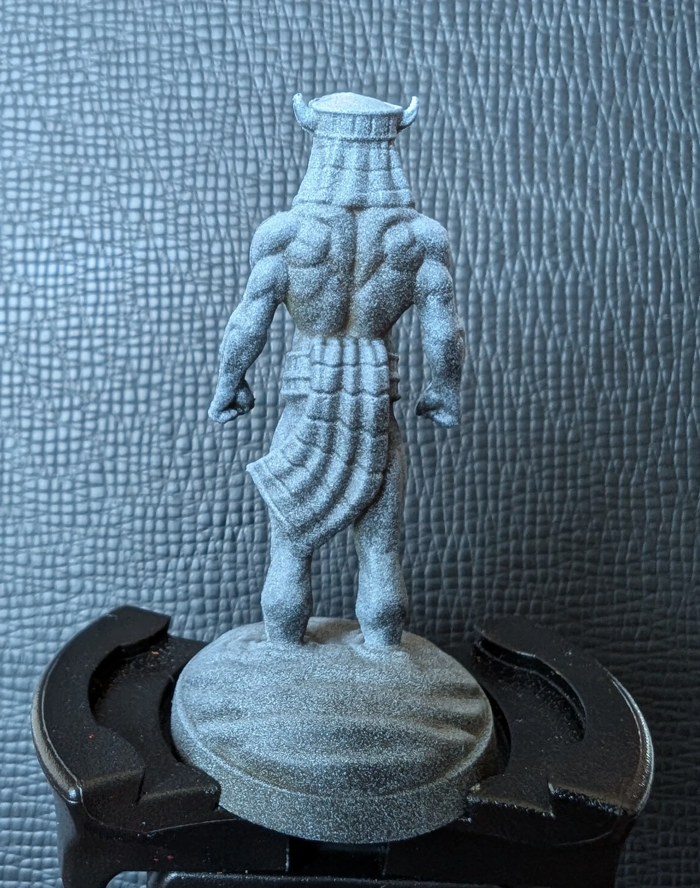
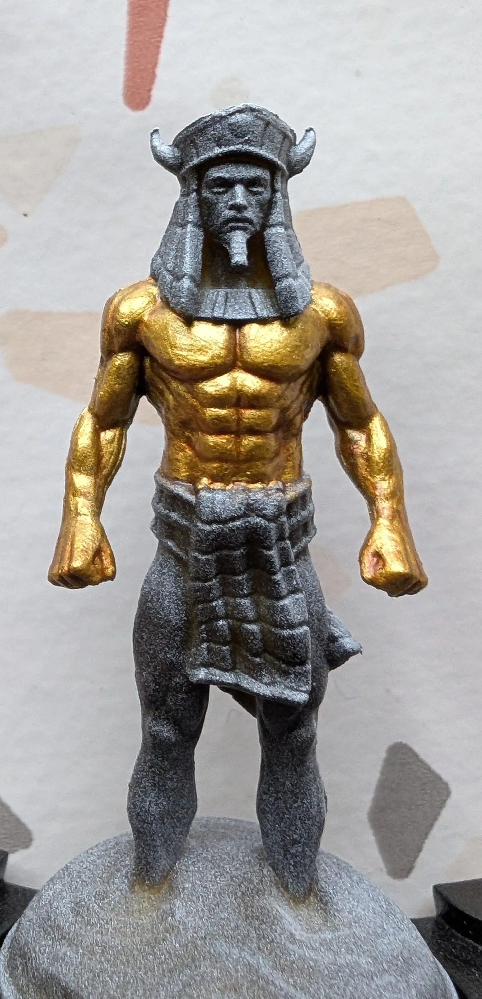
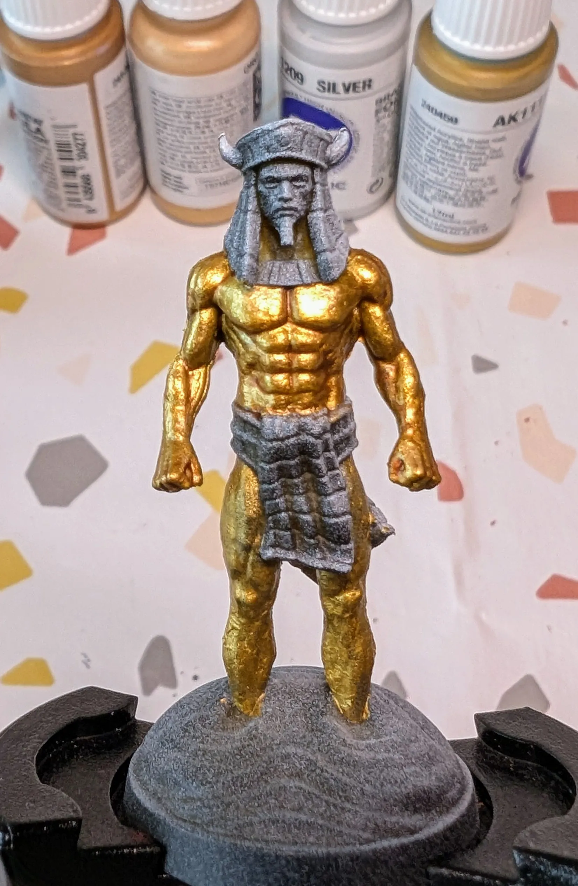
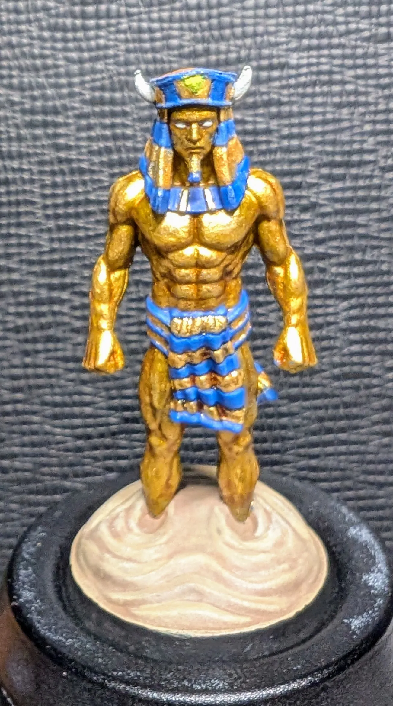

# Золотой Голем
<small>Читайте на другом языке: [:gb:](https://paint-h3.qwrtln.nl/posts/2025/02/gold-golem/) [:pl:](https://pl.paint-h3.qwrtln.nl/posts/2025/02/złoty-golem/)</small>

Окрашивание мускулов металликами - очень благодарный опыт. Золото красиво улавливает свет и подчеркивает проработанную мускулатуру.

  

<!--more-->

  

    
  

  

    
    
  

Нажмите, чтобы посмотреть видео с распаковки

  <video width="1280" height="720" controls preload="none">
    <source src="/assets/videos/gold-golem.webm" type="video/webm">
  </video>

### План

Большая часть миниатюры будет покрыта металликами, которые сами по себе блестят. Обычный зенитальный грунт помогает выявить все детали миниатюры.

{width="400px"}
/// caption
Руки слишком бледные, но кроме этого все детали четко видны.
///

{width="400px"}
/// caption
Этот Фараон никогда не пропускал день ног.
///

### Процесс

Я начал с покрытия верхней части тела старым золотом от AK, затем слой Reikland Fleshshade для затемнения углублений, и в конце слой золота Vallejo.

{width="400px"}
/// caption
Эти простые шаги уже делают "кожу" голема привлекательной.
///

{width="400px"}
/// caption
Для сравнения, ноги с одним слоем старого золота.
///

{width="400px"}
/// caption
Ноги со всеми слоями.
///

С одеждой Фараона нужно быть очень осторожным с мелкими деталями. Я выбрал свою самую тонкую синтетическую кисть для этой задачи. Синий с лазурными хайлайтами для одной части, золото для всего остального.

{width="400px"}
/// caption
Снова Reikland Fleshshade для затенения лица и не совсем белый для глаз.
///

Для трусов я использовал те же цвета, что и для головного убора, с одним отличием: я выбрал Agrax Earthshade, чтобы придать им глубину.

{width="400px"}
/// caption
С металликами сложнее создать ровный слой, в который может затечь ваш.
///

Осталась еще песчаная основа. Техники драй-браш и стиплинг помогли придать песку текстуру и однородный тон.

{width="400px"}
/// caption
Последний взгляд помогаетфиксировать места для исправления. Посмотрите на ворот - металлик переполнился немного.
///

### Вывод

Ключевые выводы:

- Покраска металликами относительно простая. Неудивительно, что люди предпочитают подход *Non-Metallic Metal.*

- Не используйте лучшие кисти для металликов! Натуральный мех слишком легко повреждается.
