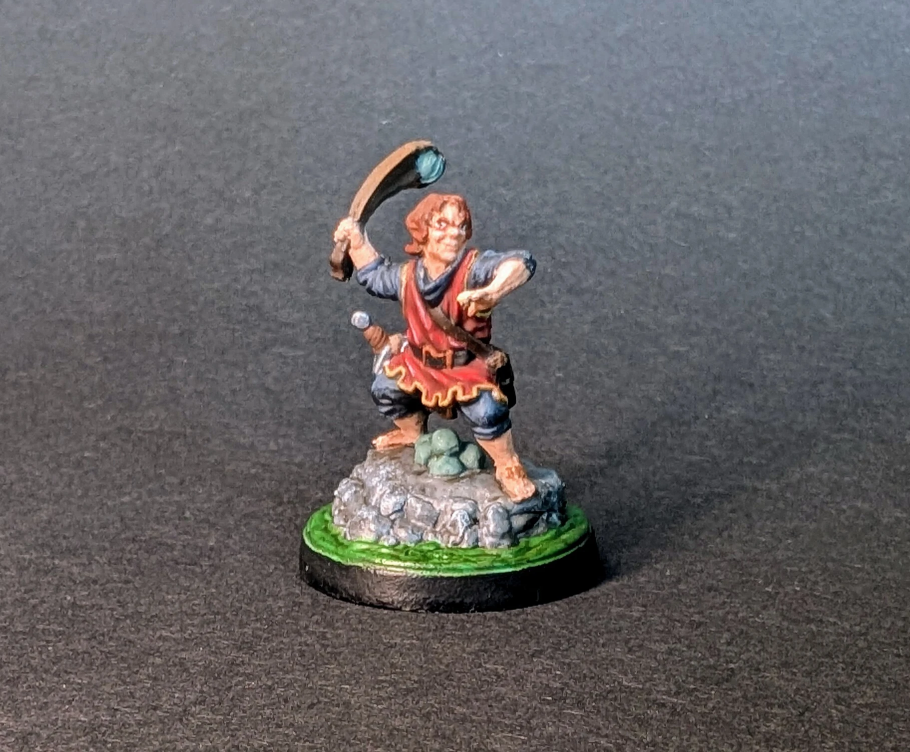
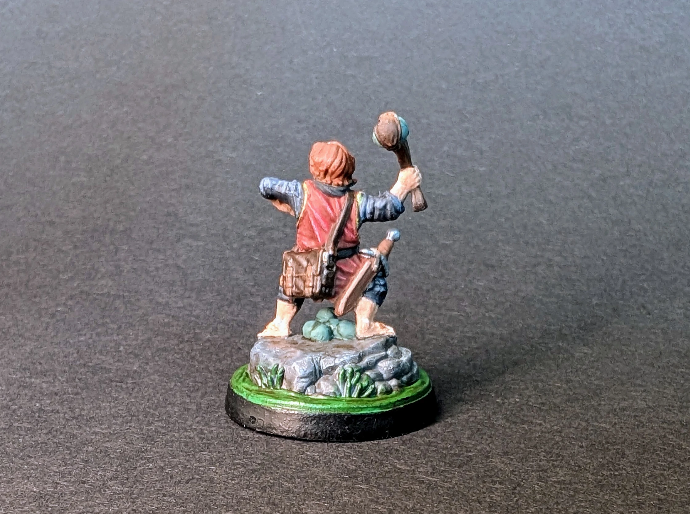

# Полурослик
<small>Читайте на другом языке: [:gb:](https://paint-h3.qwrtln.nl/posts/2025/02/halfling/) [:pl:](https://pl.paint-h3.qwrtln.nl/posts/2025/02/niziołek/)</small>

Маленькая, но сложная миниатюра для покраски.

  

<!--more-->

  

    
  

  

    
  

Нажмите, чтобы посмотреть видео с распаковки

  <video width="1280" height="720" controls preload="none">
    <source src="/assets/videos/halfling.webm" type="video/webm">
  </video>

Все детали прокрашены довольно хорошо. Лицо, с другой стороны, находится в совершенно другой лиге, до которой мои навыки не дотягивают. Глаза, очевидно, можно было бы улучшить, но я предпочитаю оставить их как есть, чтобы я мог сравнить их с моими будущими работами и увидеть прогресс.

Посмотрите Полуросликов на [Вики](https://homm3bg.wiki/units/halflings).
