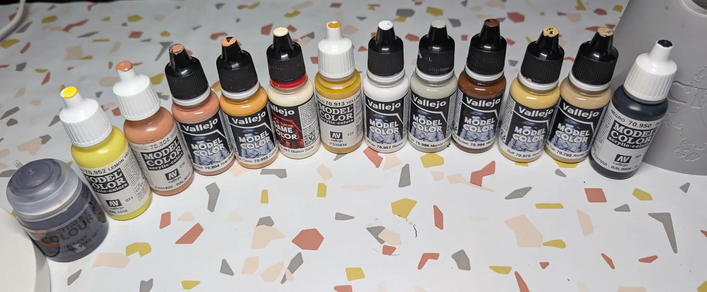

# Мумия
<small>Читайте на другом языке: [:gb:](https://paint-h3.qwrtln.nl/posts/2025/02/mummy/) [:pl:](https://pl.paint-h3.qwrtln.nl/posts/2025/02/mumia/)</small>

Покраска этой миниатюры напомнила мне [Эдди](https://ru.wikipedia.org/wiki/Эдди_(Iron_Maiden)), маскот Iron Maiden из альбома Powerslave.

  

<!--more-->

  

    
  

  

    
  

Нажмите, чтобы посмотреть видео с распаковки

  <video width="1280" height="720" controls preload="none">
    <source src="/assets/videos/mummy.webm" type="video/webm">
  </video>

Посмотрите Мумии на [Вики](https://homm3bg.wiki/units/mummies).

Освещение на этих фотографиях имеет желтоватый оттенок из-за экспериментальной настройки света. Со временем будет лучше.

### План

Как обычно, начинаю с зенитального грунтования:

 - Короткие распыления черного спрея вокруг миниатюры

 - 2-3 еще более коротких распыления белым

 - Труднодоступные для кисти места становятся видимыми

/// caption
Я наконец научился распылять краску экономно и эффективно
///

Изображение на карте явно напоминает Древний Египет и фараонов, передавая песчаные оттенки с благородными акцентами.

/// caption
Начальный выбор палитры
///

/// caption
Смешивание базового цвета для почтенных бинтов
///

### Процесс

Начать с бинтов оказалось несложно.

/// caption
Базовый цвет требует второго слоя для полного покрытия
///

Выступающие бинты служат естественными местами для хайлайтов. Достаточно податливая текстура прощает неточности движений кисти.

Металлические элементы представляли главную сложность, особенно скипетр. Хотя цвета на изображении кажутся похожими, доступные краски требовали некоторой креативности:

 - Нанёс тонкий слой золотого металлика по коричневой базе для получения тонкого блеска

 - Чистый золотой металлик для остальных металлических участков

### Вывод

Ключевые выводы:

 - Золотой металлик требует правильного базового слоя для нормального покрытия

 - Цвета на изображении заслуживают более буквальной интерпретации

 - Кончик головы змеи смотрелся бы лучше с белыми и оранжевыми высветлениями вместо однородного коричневого

 - Нужно помнить: мы создаём иллюзию реальности, а не саму реальность
