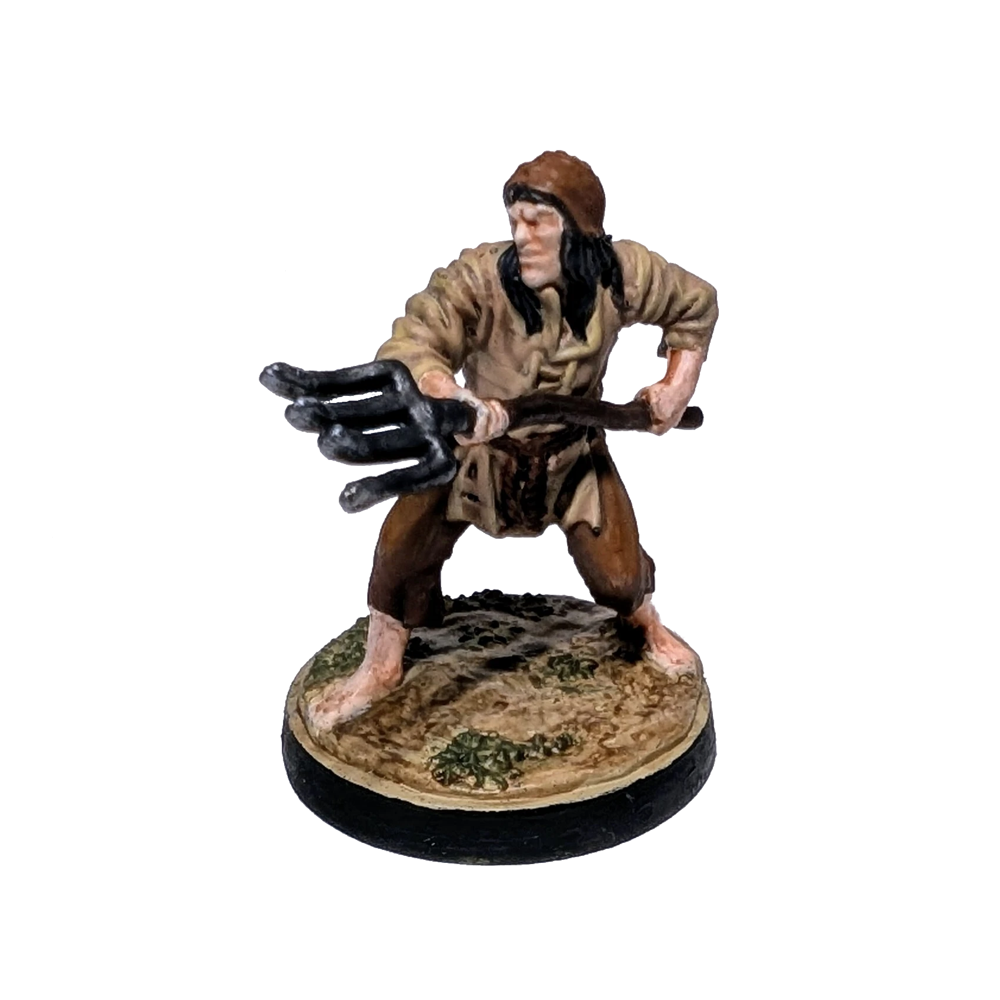

# Крестьянин
<small>Читайте на другом языке: [:gb:](https://paint-h3.qwrtln.nl/posts/2024/11/peasant/) [:pl:](https://pl.paint-h3.qwrtln.nl/posts/2024/11/chłop/)</small>

Превращаюсь в Питера Брейгеля на один день. Давайте добавим этому крестьянину немного характера, прежде чем он попадёт в преобразователь скелетов.

  

<!--more-->

Время покраски: 4 ч

Нажмите, чтобы посмотреть видео с распаковки

  <video width="1280" height="720" controls preload="none">
    <source src="/assets/videos/peasant.webm" type="video/webm">
  </video>

Посмотрите Крестьян на [Вики](https://homm3bg.wiki/units/peasants).

Впервые я решил не придерживаться цветов, указанных на карточке, так как они были слишком яркими. Настоящий крестьянин, скорее всего, носил бы более приглушённую одежду — фиолетовые рубашки точно не вписались бы в его гардероб. Миниатюра в итоге переобрела земляные тона с осенним вдохновением.

### Процесс

Я использовал базовый коричневый цвет в качестве основы для штанов, вил и шапки, но это оказалось не самым удачным решением. По совету жены я осветлил штаны и шапку немного оранжевым, а ручку вил затемнил.

Рубашка и земля оказались слишком похожими по цвету, из-за чего миниатюра выглядела плохо различимой. К счастью, травы было достаточно, и я нанес на неё dry-brush цветом, который обычно использую для кожи зомби. Даже этот приглушённый оттенок сделал миниатюру более "живой".

Вилы были покрашены металлическим серым цветом (gunmetal) с серебряными краями и добавлением немного черного чернила, чтобы приглушить блеск. А чтобы придать крестьянину более грязный вид, я использовал разбавленную краску контраста Dreadful Visage в качестве wash.

### Вывод

Моя рука постепенно перестает дрожать. Надеюсь, она успокится полностью, пока не закончатся легкие миниатюры.
