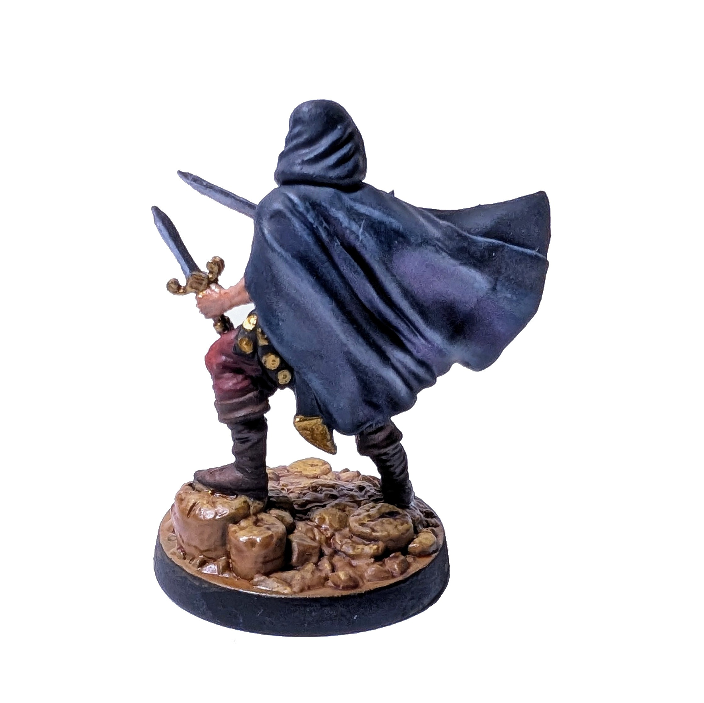

# Разбойник

Я начал покрывать краской миниатюры нейтральных юнитов, чтобы сначала набраться опыта.

  

<!--more-->

Моя первая покрашенная миниатюра. В целом, я очень доволен результатом. Особенно мне понравились тени и блики на плаще, ботинках, штанах и даже на лице. Однако, если мы посмотрим на металлические детали, то заметна неуверенная рука новичка. Подставка тоже вышла слишком глянцевой — скорее всего, из-за избыточного использования *wash*.

Время покраски: 7 ч

Посмотрите Разбойников на [Вики](https://homm3bg.wiki/units/rogues).

Нажмите, чтобы посмотреть видео с распаковки

  <video width="1280" height="720" controls preload="none">
    <source src="/assets/videos/rogue.webm" type="video/webm">
  </video>

