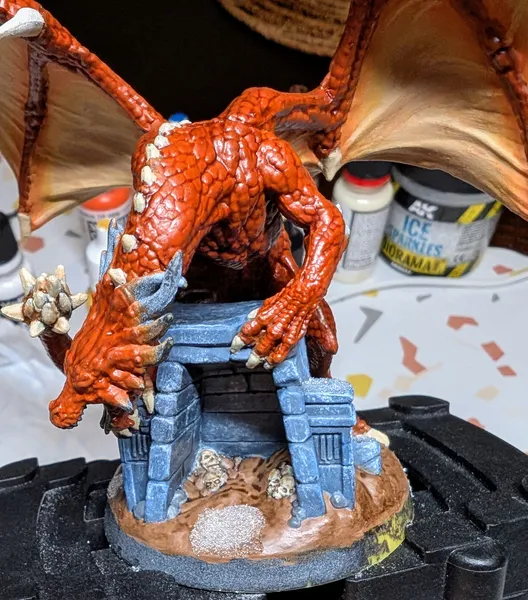

# Ржавый Дракон
<small>Читайте на другом языке: [:gb:](https://paint-h3.qwrtln.nl/posts/2025/02/rust-dragon/) [:pl:](https://pl.paint-h3.qwrtln.nl/posts/2025/02/rdzawy-smok/)</small>

Ржавые Драконы занимали позицию третьего самого сильного юнита в видеоигре. Их место было заменено на Кристальных Драконов в настольной версии.

    

<!--more-->

  

    
  

  

    
  

Нажмите, чтобы посмотреть видео с распаковки

  <video width="1280" height="720" controls preload="none">
    <source src="/assets/videos/rust-dragon.webm" type="video/webm">
  </video>

Посмотрите Ржавых Драконов на [Вики](https://homm3bg.wiki/units/trolls).

### План

Эта миниатюра значительно крупнее большинства других, поэтому требует особого подхода. Сначала я покрою большие области одного цвета кистью 'кошачий язычок', а затем перейду к деталям.

### Процесс

Глядя на изображение на карте, у дракона оранжевая чешуя. Смесь оранжевого с небольшим добавлением коричневого должна дать хороший базовый цвет.

#### Чешуя

Я покрыл все тело дракона большой кистью 'кошачий язычок'.

/// caption
Цвет слабый, потребуется несколько слоев.
///

Нанесите столько слоев, сколько необходимо для полного покрытия.

/// caption
Несколько слоев спустя.
///

Завершите соответствующим wash'ем, чтобы затемнить углубления между чешуйками.

/// caption
Wash Reikland Fleshshade творит чудеса.
///

#### Крылья

Крылья нуждаются в более ярком цвете с градиентными переходами вокруг костной структуры. Сначала я покрыл области, не прилегающие непосредственно к телу дракона.

/// caption
Базовый слой для крыльев.
///

/// caption
Больше слоев с более темными краями.
///

На этом этапе я понял, что лучше покрыть все крылья одним цветом и использовать glaze вокруг костной структуры. Однако не всё потеряно. *Хайлайты* придадут крыльям немного объема, а переходы все еще можно сгладить.

/// caption
Начальные хайлайты на крыльях.
///

/// caption
Внутренние хайлайты.
///

#### Когти

Когти относительно просто покрасить. Следы износа и хайлайт добавлю на более позднем этапе.

/// caption
Я оставил голову неокрашенной, чтобы заняться ею позже.
///

#### Подставка

База этой миниатюры довольно сложная. На референсе изображена конструкция, похожая на здание, земля, камни, черепа и снег. Я начал со здания.

/// caption
Нанёс серый с оттенком синего, лазурный вокруг краёв, и сделал dry-brush белым для текстуры.
///

/// caption
Обе стороны требуют аккуратного dry-brush.
///

/// caption
Камни на заднем плане были покрашены без синего оттенка.
///

Для основания я выбрал цвет, похожий на грязь с проталинами тающего снега. Для эффекта снега я использовал Ice Sparkles от AK.

/// caption
Земля с проталинами тающего снега.
///

/// caption
Черепа неудачливых искателей приключений внутри.
///

#### Голова

Голова - это центральная точка миниатюры, поэтому её детали и хайлайты должны быть самыми выразительными. Я тщательно прокрасил морду зверя, нанёс самые сильные хайлайты и добавил эффект свечения глаз.

/// caption
Морда со светящимися глазами.
///

Наконец я покрасил шипы на голове. Эффект старения я получил с помощью ваш Agrax Earthshade, который затем нанес на все оставшиеся шипы.

/// caption
Состаренные шипы завершают миниатюру.
///

### Вывод

Ключевые выводы:

 - Используйте кошачий язычок для больших поверхностей, чтобы сэкономить время

 - Покраска глаз выполнима с правильной кистью

 - Создание градиентных переходов легче с помощью *глейз*, чем вручную

 - Жена-дизайнер - это золото, но друзья, позволяющие попробовать снаряжение, которое ты еще не купил - это серебро
