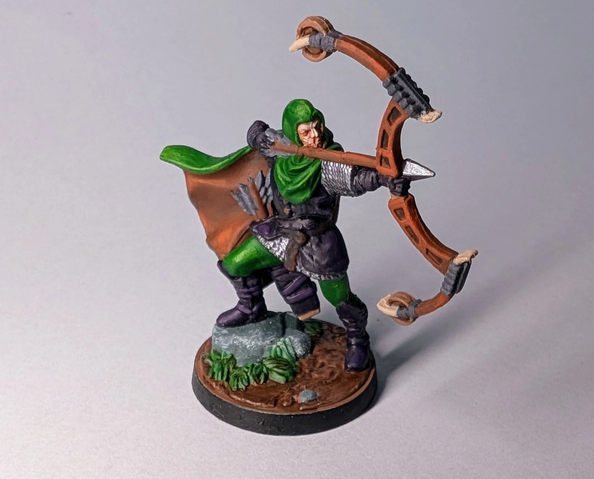
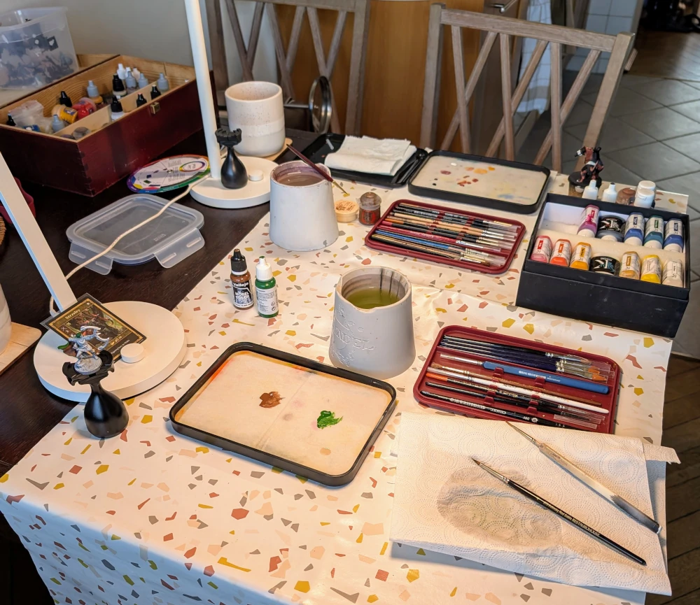
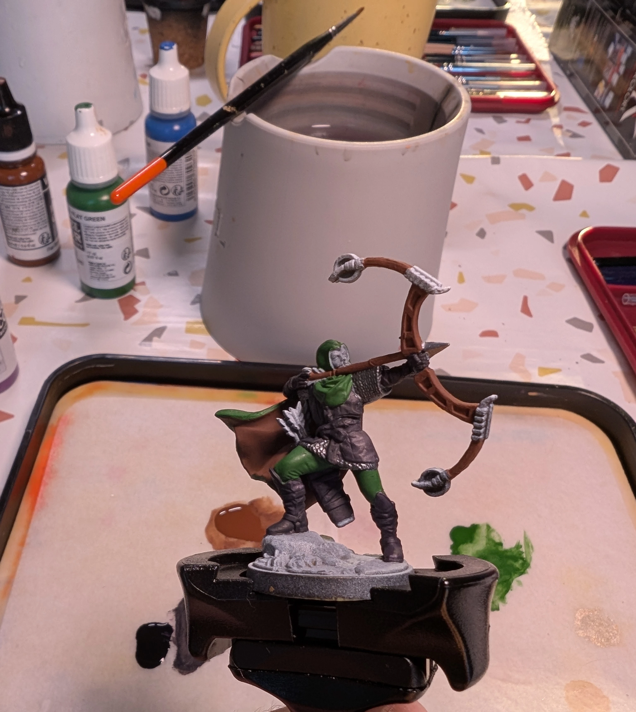
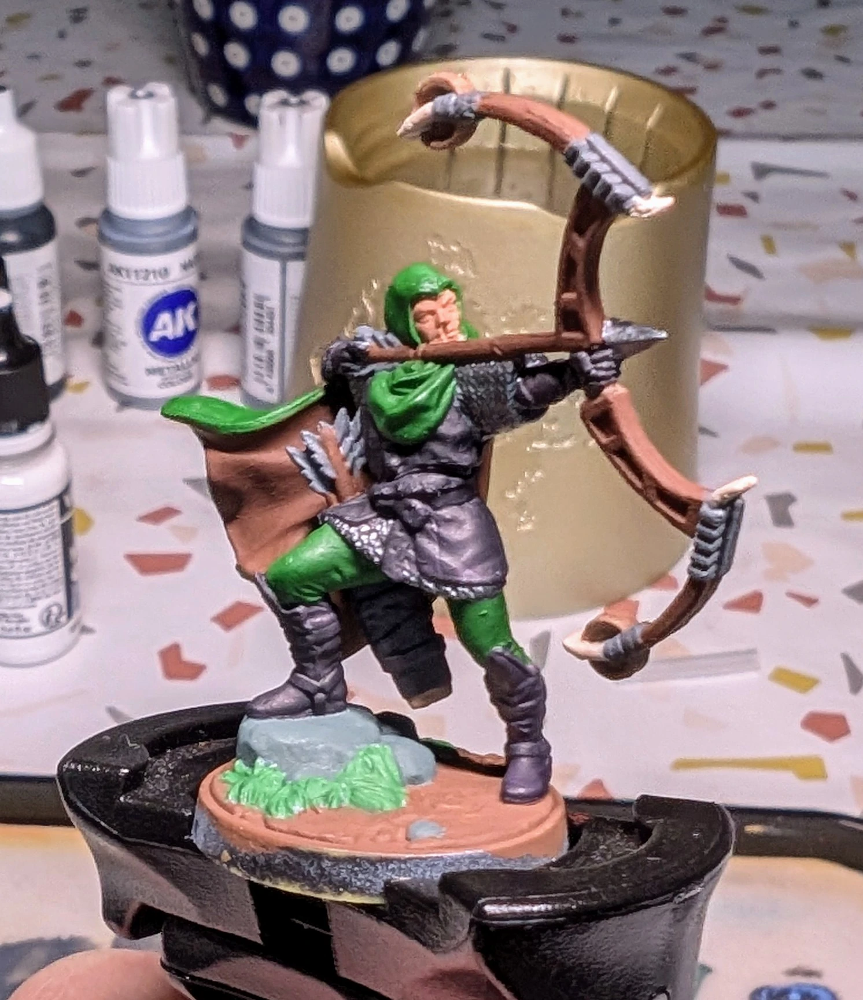

# Снайпер
<small>Читайте на другом языке: [:gb:](https://paint-h3.qwrtln.nl/posts/2025/03/sharpshooter/) [:pl:](https://pl.paint-h3.qwrtln.nl/posts/2025/03/strzelec/)</small>

Роскошную накидку всегда весело красить.

  

<!--more-->

  

    
  

  

    
    
  

Нажмите, чтобы посмотреть видео с распаковки

  <video width="1280" height="720" controls preload="none">
    <source src="/assets/videos/sharpshooter.webm" type="video/webm">
  </video>

Мне нужно отказаться от своих прежних утверждений о бесполезности туториалов с YouTube. [Руководство Винса Вентуреллы по хайлайтам](https://youtu.be/W8uCKcF3aUc) невероятно полезно. Ключевой вывод: мы рисуем свет, а не реальные цвета.

### Процесс

Начнём с совета по мотивации: гораздо сложнее откладывать на потом, когда красишь вместе с друзьями.

/// caption
Импровизированная мастерская для двоих на кухонном столе.
///

Чтобы быстро продвигаться, сначала покрась большие поверхности большой кистью. Плащ и лук — очевидный выбор (плоский коричневый и плоский зеленый). Остальное — ган-метал для кольчуги и черный + фиолетовый для кожаной одежды. Интересно, одевались ли настоящие средневековые снайперы так стильно.

/// caption
Эти мелкие детали, оставшиеся для покраски, довольно трудоемки.
///

/// caption
Базовые слои готовы. Видишь ту чашку на заднем плане? Теперь она золотая, ха-ха.
///

После нанесения базовых слоёв, я перешёл к хайлайтам, используя оранжевый по коричневому, жёлтый по зелёному, фиолетовый по чёрному и серебряный по ган металу. В этот раз я экономно использовал wash: только на основании и в углублениях лука (которые в реальности были бы отверстиями). Стоит помнить также о драй браше на камнях. Эта техника настолько потрясающая, что должна быть незаконной.

### Вывод

Ключевые выводы:

 - Посмотри [видео Винса](https://youtu.be/W8uCKcF3aUc), если ещё не видел. Действительно стоит. Это художник миниатюр высочайшего класса.

 - Размещение миниатюры под сильным лучом света очень полезно. Можно увидеть, где должны располагаться хайлайты и тени.

 - Сделай одолжение своему другу, который давно не рисовал, и пригласи его на совместный сеанс покраски.
