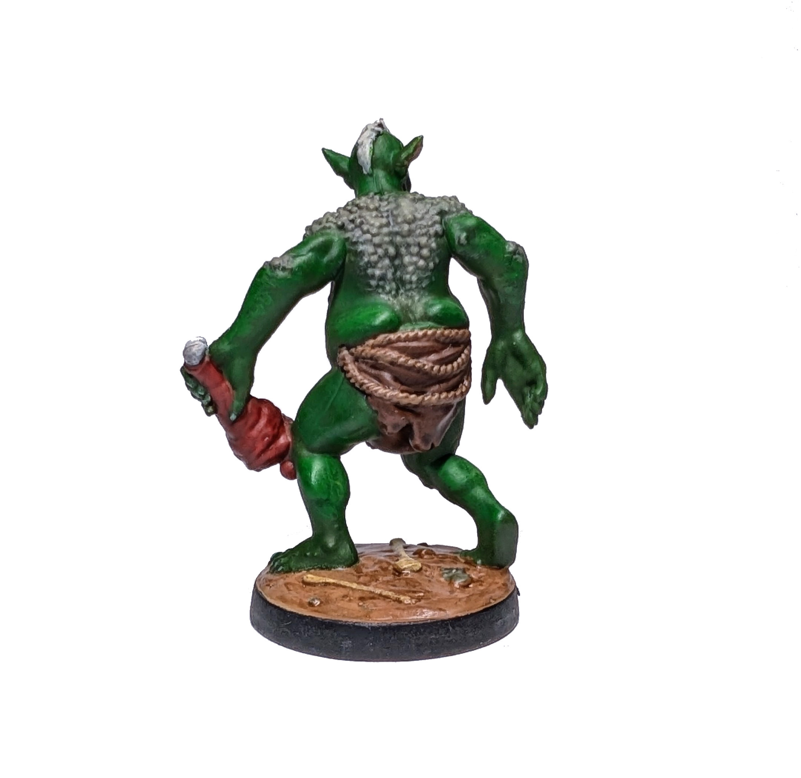

# Тролль

Мой второй нейтральный юнит.

  

<!--more-->

Зеленую кожу, как говорят, красить легче, чем человеческую. Однако корка на текстуре оказалась не такой простой (для нее понадобился немного кривоватый dry-brushing). Тем не менее желтоватые блики получились очень хорошо. Это также была моя первая попытка покрасить детали лица, а именно глаза и зубы. Очень рад, что все получилось с первого раза.

Время покраски: 5 ч

Посмотрите Троллей на [Вики](https://homm3bg.wiki/units/trolls).

Нажмите, чтобы посмотреть видео с распаковки

  <video width="1280" height="720" controls preload="none">
    <source src="/assets/videos/troll.webm" type="video/webm">
  </video>

